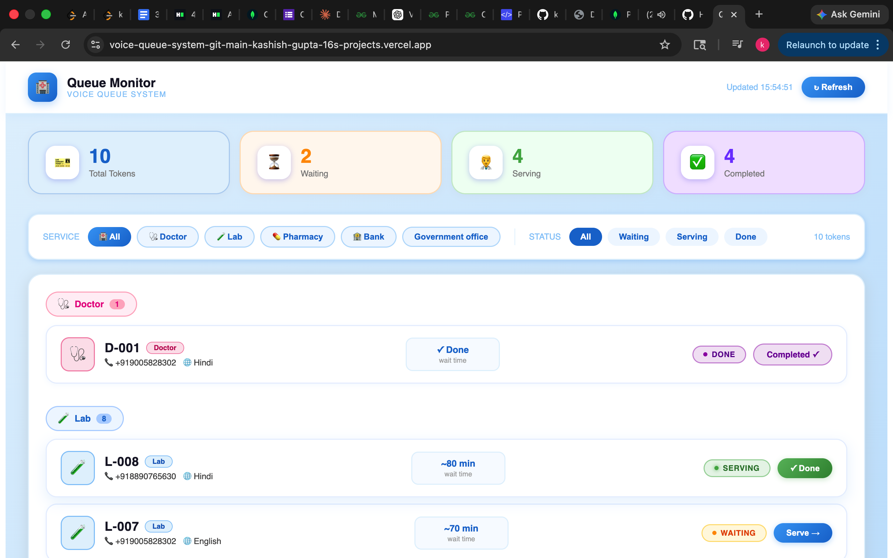

# 🎙️ Voice-Based Queue Management System

## 📌 Overview

The **Voice Queue System** is a full-stack application that allows users to join a queue using a simple phone call.
It uses **IVR (Interactive Voice Response)** to collect user input, generates a token, and sends confirmation via SMS and voice.

This system helps eliminate long physical queues and improves service efficiency in places like hospitals, banks, and government offices.

---

## System Architecture
User Call → IVR System → Backend (Node.js) → Token Generation → SMS + Voice Response → Admin Dashboard
                          ↓
                        MongoDB

---

## 🚀 Features

* 📞 IVR-based interaction (DTMF input)
* 🌐 Multi-language support (Hindi / English)
* 🎟️ Automatic token generation
* 🗄️ Token storage using MongoDB
* 📩 SMS notification (Token + Expected Time)
* 🔊 Voice confirmation
* 📊 Admin dashboard to view all tokens

---

## 🛠️ Tech Stack

**Frontend (Dashboard):**

* HTML
* CSS
* JavaScript
* React.js

**Backend:**

* Node.js
* Express.js

**Database:**

* MongoDB (Mongoose)

**APIs / Services:**

* Exotel (for IVR & SMS)
* Ngrok (for local testing)

---

## 🧩 Project Structure

```
voice-queue-backend/
│
├── src/
│   ├── server.js
│   ├── jobs/
│   │     └── tokenexpiry.jobs.js
│   ├── models/
│   │     └── token.models.js
│   │     └── queue.models.js
│   │     └── session.models.js
│   │     └── service.models.js
│   │     └── smslog.models.js
│   ├── routes/
│   │     ├── ivr.routes.js
│   │     └── dashboard.routes.js
│   │     └── exotel.routes.js
│   │     └── simulate.routes.js
│   │     └── token.routes.js
│   ├── controllers/
│   │     ├── ivr.controllers.js
│   │     └── dashboard.controllers.js
|   |     └── simulate.controllers.js
|   |     └── token.controllers.js
│   ├── services/
│   │     └── exotel.services.js
│   │     └── queue.services.js
│   │     └── sms.services.js
│   │     └── token.services.js
│   │     └── tts.services.js
│
├── dashboard/
│   ├── public/
│   │     └── index.html
│   ├── src/
│   │    ├── components/
│   │    │     └── QueueTable.js
│   │    │     └── TokenCard.js
│   │    ├── pages/
│   │    │     └── dashboard.js
│   │    ├── services/
│   │    │     └── api.js
│   │    ├── App.js
│   │    ├── index.js
│
├── .env
├── package.json
└── README.md
```

---

## ⚙️ Installation & Setup

### 1️⃣ Clone Repository

```bash
git clone https://github.com/your-username/voice-queue-system.git
cd voice-queue-system
```

---

### 2️⃣ Install Dependencies

```bash
npm install
```

---

### 3️⃣ Setup Environment Variables

Create a `.env` file:

```
PORT=8000
MONGO_URI=mongodb+srv://voice-queue1:<db_password>@voice-queue-cluster.fosdxzq.mongodb.net/?appName=voice-queue-Cluster
```

---

### 4️⃣ Run the Server

```bash
npm run dev
```

Server will run on:

```
http://localhost:8000
```

---

### 5️⃣ Run Ngrok (for IVR testing)

```bash
ngrok http 8000
```

Use generated URL in Exotel webhook.

---

## 📞 IVR Flow

1. Patient calls Exophone
2. "Press 1 for Hindi, Press 2 for English"
3. "Press 1 for Doctor, Press 2 for Lab, Press 3 for Pharmacy"
4. Token generated → "Your token is D-001, wait 20 minutes"
5. SMS sent → "Your token is D-001. Estimated wait 20 minutes"
6. Patient calls back → hears current queue position

---

## 📊 API Endpoints

### IVR Endpoint

```
POST /ivr/exotel
```

### Dashboard API

```
GET /token/all
```

---

## 🧪 Testing (Postman)

**POST** `/ivr/exotel`

Body (x-www-form-urlencoded):

```
Digits = 1
```

---
## Dashboard Preview


## 💡 Use Cases

* 🏥 Hospitals
* 🏦 Banks
* 🏢 Government offices
* 🧾 Service centers

---

## 🎯 Future Improvements

* 🔄 Real-time queue updates
* 📱 Mobile app integration
* 🤖 AI voice assistant
* 🌍 Multi-language expansion
* 📊 Analytics dashboard

---

## 👨‍💻 Author

**Kashish Gupta**
BTech Student | Developer

---

## ⭐ Contribution

Feel free to fork this repository and improve it!

---

## 📜 License

This project is proprietary software.  
All rights reserved © 2026 Voice Queue System.  
Unauthorized use, copying, modification, or distribution is strictly prohibited.
